# 内存地址转换实验

> 本实验运行了一个设置了全局变量的的循环程序，通过查看段寄存器，LDT表，GDT表等信息，经过一系列段、页式地址转换，找到程序中该全局变量的物理地址

## 实验原理

### 1.逻辑地址到线性地址的转换

**逻辑地址**：Intel中，一个逻辑地址由一个段标识符，加上一个指定段内相对地址的偏移量。

- 段标识符: 也称为段选择符，属于逻辑地址的构成部分，段标识符是由一个 16 位长的字段组成，其中前 13 位是一个索引号。后面 3 位包含一些硬件细节
- 索引号：可以看作是段的编号，也可以看做是相关段描述符在段表中的索引位置。

系统中的段表有两类：GDT 和 LDT。

- GDT：全局段描述符表，整个系统一个，GDT 表中存放了共享段的描述符，以及 LDT 的描述符（每个 LDT 本身被看作一个段）

- LDT：局部段描述符表，每个进程一个，进程内部的各个段的描述符，就放在 LDT 中。

- TI 字段：TI=0，表示相应的段描述符在 GDT 中，TI=1 表示表示相应的段描述符在 LDT 中。

段描述符(即段表项)：具体描述了一个段。在段表中，存放了很多段描述符。我们可以通过段标识符的前 13 位，直接在段描述符表中找到一个具体的段描述符，也就是说，段标识符的前 13 位是相关段描述符在段表中的索引位置。

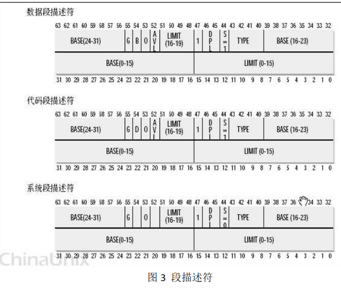

- Base 字段：它描述了一个段的开始位置：段基址。Base(24-31)：基地址的高 8 位，Base(16-23)：基地址的中间 8 位，Base(0-15)：基地址的低 16 位。

相关**寄存器**：

- GDTR：存放 GDT 在内存中的起始地址和大小
- LDTR：分两种情况：
  - (1) 当段选择符中的 TI=1 时，表示段描述符存放在 LDT 中，如何找到 LDT 呢，LDT本身也被看作一个段，LDT 的起始地址存放在 GDT 中，此时 LDTR 存放的就是LDT 在 GDT 中的索引。这也是本实验关注的情况。
  - (2) 当段选择符中的 TI=0 时，表示段描述符存放在 GDT 中，通过 GDTR 找到 GDT， 当 TI=0 时，不涉及对 LDT 和 LDTR 的使用。

- 段选择符：如在 DS，SS 等寄存器内存储，取高 13 位作为在相应段表（如上例中的 DS 的高 13 位为对应段在 LDT）中的索引。

**线性地址**： 段标识符用来标明一个段的编号，具体的，我们需要通过段的编号，查找段表，来获得这个段的起始地址，即段基址。如前所述，这里的段基址，不是相应的段在内存中的起始地址，而是程序编译链接以后，这个段在逻辑

地址空间里的起始位置。进一步的，段基地址＋段内偏移量，就得到线性地址（即要访问的数据在整个程序逻辑(虚拟)地址空间中的位置）。

从逻辑地址到线性地址的转换过程：此时从段选择符 DS 中分离出段索引号（高 13 位）和 TI 字段，TI=1，表明段描述符存放在 LDT 中：

- （1）从 GDTR 中获得 GDT 的地址，从 LDTR 中获得 LDT 在 GDT 中的偏移量，查找 GDT，从中获取 LDT 的起始地址；

- （2）从 DS 中的高 13 位获取 DS 段在 LDT 中索引位置，查找 LDT，获取 DS 段的段描述符，从而获取 DS 段的基地址；

- （3）根据 DS 段的基地址＋段内偏移量，获取所需单元的线性地址。

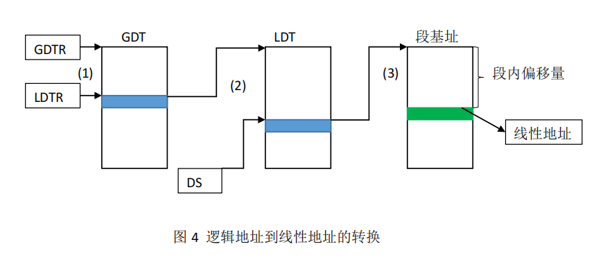

### 2.线性地址到物理地址的转换

**物理地址**：分段是面向用户，而分页则是面向系统，以提高内存的利用率，简言之，内存空间是按照分页来管理的。一个 32 位的机器，支持的内存空间是 4G，在页面大小为 4KB 的情况下，如果采用二级分页管理方式，线性地址结构如图所示：

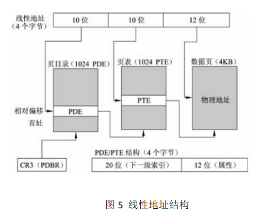

每一个 32 位的线性地址被划分为三部份， 页目录索引(10 位)：页表索引(10 位)：偏移(12 位，因为页面大小为 4K)。最终，我们需要根据线性地址，来获得物理地址。

将线性地址转换成物理地址的步骤：

- (1)、因为页目录表的地址放在 CPU 的 cr3 寄存器中，因此首先从 cr3 中取出进程的页目录表（第一级页表）的起始地址（操作系统负责在调度进程的时候，已经把这个地址装入对应寄存器）；
- (2)、根据线性地址前十位，在页目录表（第一级页表）中，找到对应的索引项，因为引入了二级管理模式，线性地址的前十位，是第一级页表中的索引值，根据该索引，查找页目录表中对应的项，该项即保存了一个第二级页表的起始地址。
- (3)、查找第二级页表，根据线性地址的中间十位，在该页表中找到数据页的起始地址；
- (4)、将页的起始地址与页内偏移量（即线性地址中最后 12 位）相加，得到最终我们想要的物理地址；


## 实验过程

1、点击 bochs.exe 安装 bochs。 

2、拷贝 bootimage-0.11-hd 、 diska.img 、 hdc-0.11-new.img 、mybochsrc-hd.bxrc 至安装目录。

3、在安装目录中找到 bochsdbg.exe 程序，并运行。

4、在弹出的界面中，点击“Load”加载配置文件“mybochsrc-hd.bxrc”。随后，点击“Start”启动 Bochs 虚拟机。

5、虚拟机启动后，出现两个窗口，一个为 Bochs 控制窗口，另一个为Linux 操作系统运行窗口（主显示窗口）。

6、在控制窗口输入“c”后回车，加载 Linux 操作系统。

7、在 Linux 操作系统中，使用 vi 工具编写 mytest.c 源文件。随后执行“gcc -o mytest mytest.c”命令编译并生成“mytest”可执行文件。

```cpp
#include <stdio.h>

int j = 0x10801017;

int main() {
    printf("the address of j is 0x%x\n",&j);
    while(j);
    printf("program	terminated normally!\n");
    return 0;
}
```

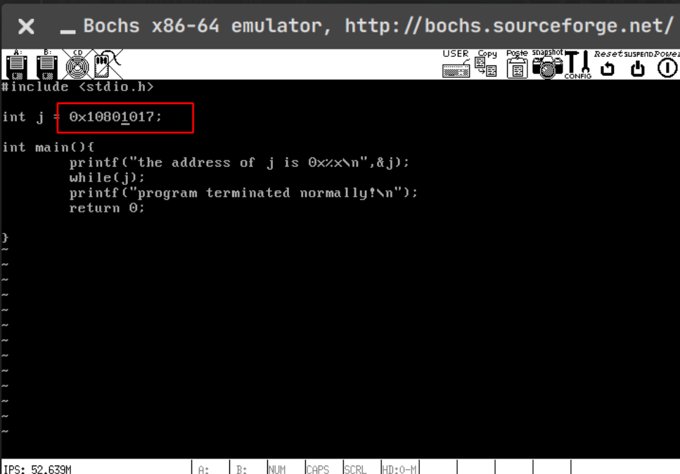

8、在 Linux 操作系统中，运行“./mytest”可执行文件

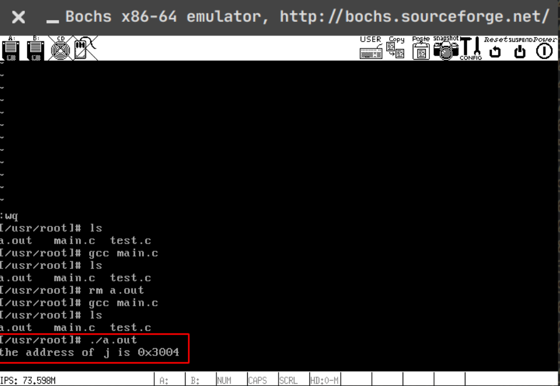


9、控制窗口按 Ctrl+c，进入调试状态。

10、在控制窗口中输入 sreg 命令，查看段的具体信息。

可以看到 ds 段的段标识符信息是 0x0017（0000000000010111）,对应 TI=1，表明段描述符在 LDT 中，右移 3 位之后为 0x02，即表示在局部描述符表 LDT 的偏移量为 2。

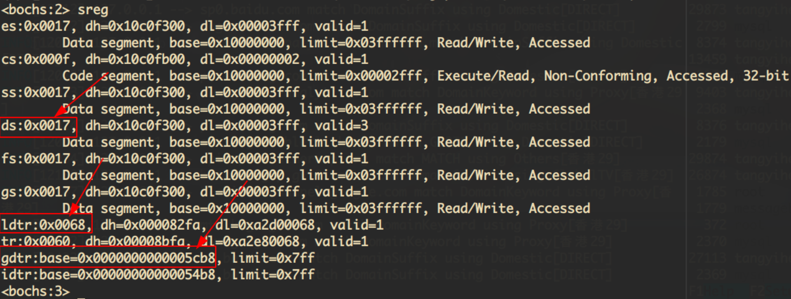

11、查看 LDTR 寄存器，其中存放了 LDT 在 GDT 的位置。0x0068 对应 TI=0，右移 3 位之后为 0x0D，即在 GTD 中的索引为(0x0D) 13。

12、gdtr 存放了 GDT 的起始地址，用 xp /2w 0x00005cb8+13*8（每个描述符占 8 个字节）查看 GDT 中对应表项，得到的 LDT 段描述符，从而我们可以得到 LDT 的基址为 0x00fd42d0。

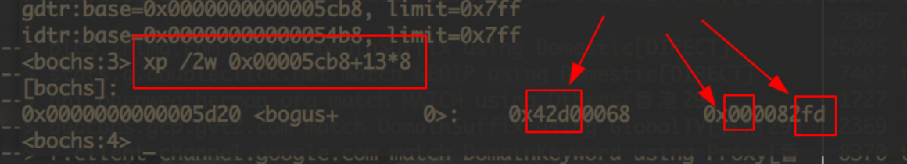

13、用 xp /2w 0x00fd42d0+2*8，查看 LDT 中第 2 项段描述符（即 ds 段的描述符信息，应与 ds 寄存器（dl、dh）中的数值完全相同

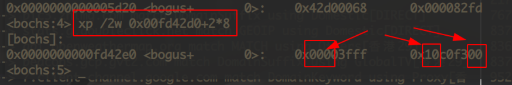

14、计算出 ds 段的基地址为 0x10000000（与用 sreg 得到信息一致）。

15、计算线性地址 0x10000000+0x3004=0x10003004， 将其用 0 补满 32 位(0001 0000 0000 0000 0011 0000 0000 0100)，然后按照 10-10-12 比特的方式划分，为 0x40-0x03-0x04。即第一级页表内的索引为 0x40，第二级页表内的索引为 0x03，页内偏移为 0x04。

16、使用 creg 查看寄存器 CR3 值为 0，即页目录表（第一级页表）的起始地址为 0

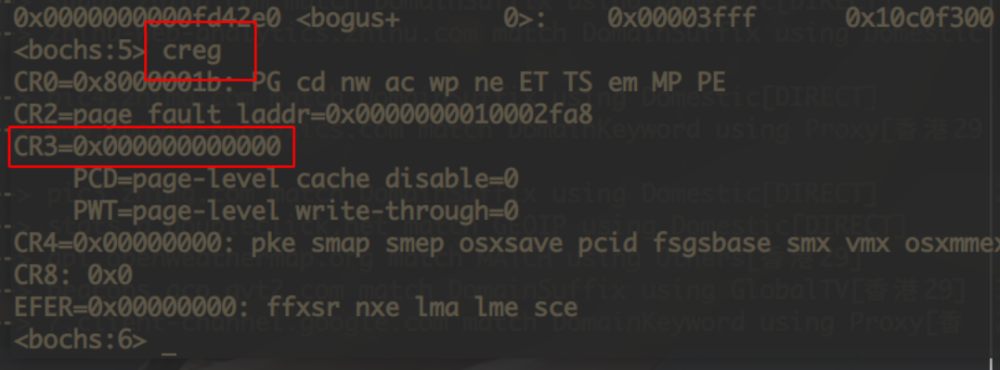

17、使用 xp /w 64*4 查看 PDE 为 0x00fa6027,下一级索引为 0x00fa6000。

（或执行 xp /2w 0x40*4）

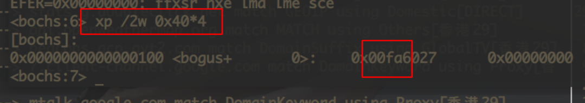

18、18、使用 xp /w 0x00fa6000+3*4 查看 0x00fa3067,下一级索引为 0x00fa3000，得到物理地址为 0x00fa6000+4。

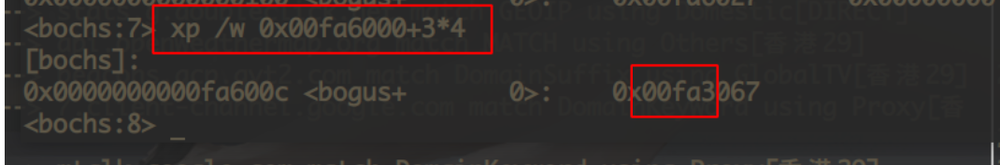

19、使用 xp /w 0x00fa3000+4,内容为 0x10801017 与我们所设的值相同。

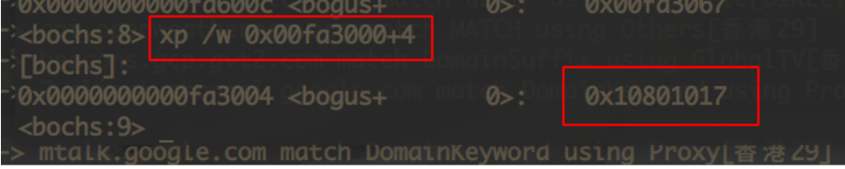

20、使用 setpmem 0x00fa6004 4 0,设置 0x00fa6004 开始的四个字节均为 0，并检查是否成功。

21、成功之后输入 c 继续运行，显示程序正常结束。

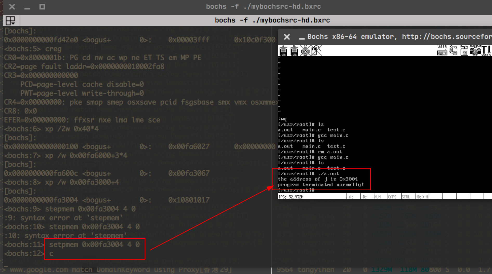