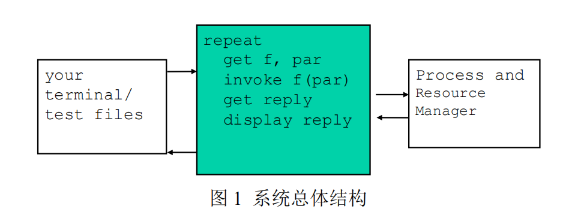
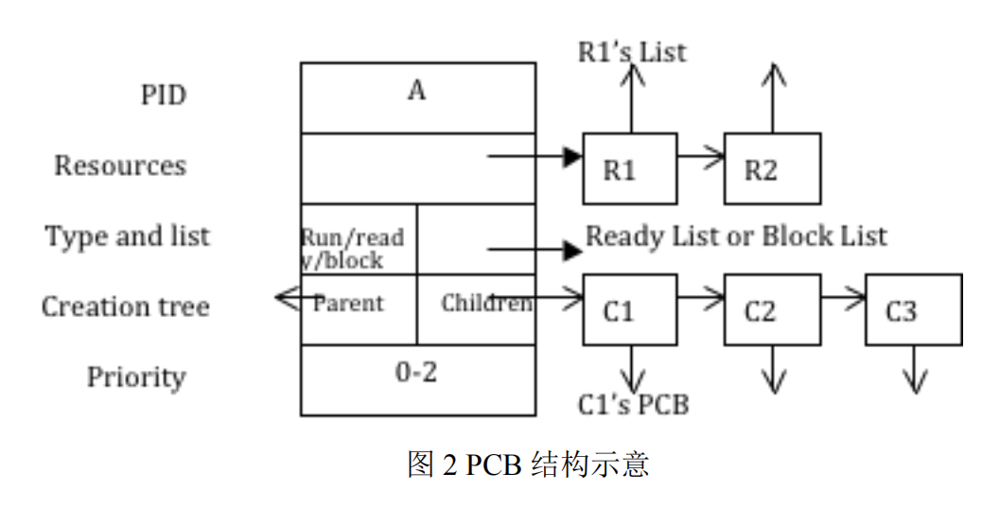
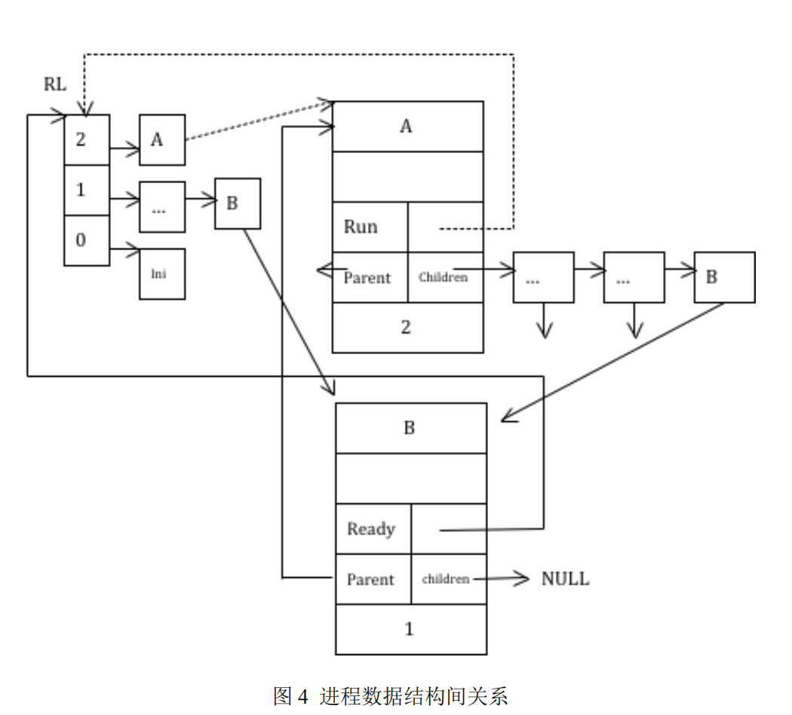
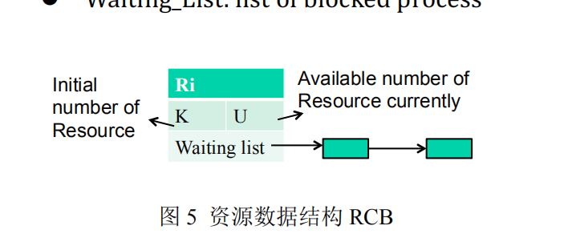

# 进程与资源管理器

## 一.系统功能需求分析

1. 进程控制：能完成进程的控制，如进程的创建与销毁、进程的状态转换
2. 进程调度：能基于优先级调度算法完成进程的调度，模拟时钟中断，完成对时钟中断的处理，在同等优先级的进程中按照时间片轮转调度算法对进程进行调度
3. 资源管理：能够完成资源的分配与释放
4. 进程同步：能够对进程在资源管理过程中的同步
5. 测试程序：能够在管理器之外如用户终端发送指令，或者从文件批量读取指令，实际操作进程

## 二.总体框架设计



- 最右侧为进程与资源管理器部分，属于操作系统内核的功能，它具有的功能有：
  - 进程创建与销毁、进程调度
  - 多资源管理、进程同步
  - 时钟中断
- 中间绿色部分为`Shell`外壳程序，负责测试我们设计的进程与资源管理器，它具有的功能有：
  - 从用户终端或输入文件读取指令
  - 将用户的指令转换为实际模拟进程控制的内核函数
  - 在用户终端或输出文件显示调度结果

## 三.具体模块设计

### 1.进程管理设计

#### 1.1.进程PCB



- PID：表示进程的唯一标识符
- Resources：表示进程申请到正在使用的资源
- Type and list：表示进程的状态及对应到的队列（就绪队列、阻塞队列...）
- Creation tree：表示进程创建树，一个进程可以创建多个子进程，但一个子进程只能被一个父进程创建，所以使用树型结构来表示这种数据关系
- Priority：表示进程的调度优先级，分为0、1、2（分贝对应初始级、用户级、内核级）

```c
/*
 * structure of the process control block (PCB)
 */
struct pcb {
    int id;                                 // the unique process identifier
    re_l_node_t  **resource_list;           // the resource list  
    process_status_t *status;               // the process status 
    creation_tree_t *creation_tree;         // the pointers to parent process and child process list
    int priority;
    pcb_t *rl_next;                         // the next pointer for process in the ready list
    pcb_t *bl_next;                         // the next pointer for process in the blocked list
    pcb_t *cl_next;                         // the next pointer for process in the child list
};
/*
 * the structure of the node for resoure list in pcb.
 */
struct re_l_node {
    rcb_t *r;                               // the rcb
    int n;                                  // the numebr of the resoure
    re_l_node_t *next;
};
/* 
 * structure of the status for pcb
 */
struct process_status {
    int type;                               // the process status: ready, run and block
    pcb_t **list;                           // the list process belong to: Blocked List or Ready List
};
/*
 * the structure of the creation_tree for pcb.
 */
struct creation_tree {
    pcb_t *parent;                          // the parent process
    pcb_t **child;                          // the child process list
};

```

#### 1.2.进程状态

- 就绪态：Ready
- 运行态：Runnning
- 阻塞态：Blocked

```cpp
/* constant for process status */
#define STATUS_READY 0
#define STATUS_RUNNING 1
#define STATUS_BLOCKED 2
```

#### 1.3.进程操作

- 创建进程（create）：进程创建完成之后进程状态转换为 Ready
- 销毁进程（destroy）：进程销毁完成之后进程PCB被回收，进程状态由Ready/Running/Blocked变为None
- 请求资源（Request）：进程申请资源失败，则进程状态从Running变为Blocked，否则进程状态不发生变化
- 释放资源（Release）：进程释放资源之后，如果正好有因为申请此资源而阻塞的进程，并且数目满足需求的话，进程状态从Blocked变为Ready
- 时钟中断（Interrupt）：模拟时钟中断，当前进程状态由Running变为Ready
- 进程调度（Scheduler）：模拟进程调度

```c
/* create a new process with id and priority */
pcb_t *create(const int id, int priority);

/* destroy a process */
void destroy(int id);

/* current running process request a certain number of resoures */
void request(int id, int num);

/* current running process release a certain number of resoures */
void release(int id, int num);

/* schedule process */
void scheduler();

/* clock interrupt */
void interrupt();
```

#### 1.4.主要函数

##### 1.4.1.创建进程

根据指定的PID和优先级创建一个新的进程，首先要初始化它的PCB，然后将其插入到当前进程的Creation_tree中，接着将其插入到就绪队列中，调用Scheduler()进行调度



```c
pcb_t *get_new_pcb() {return (pcb_t *) malloc(sizeof(pcb_t)); }
/*
 * create - create a new process 
 */
pcb_t *create(int id, int priority) {
    // create a new pcb and initialize the pcb
    pcb_t *p = get_new_pcb();
    p->id = id;
    p->resource_list = calloc(1, sizeof(re_l_node_t *));
    p->status = (process_status_t *) malloc(sizeof(process_status_t));
    p->status->type = STATUS_READY;
    p->status->list = &rl;
    p->creation_tree = (creation_tree_t *) malloc(sizeof(creation_tree_t));
    p->creation_tree->parent = self;
    p->creation_tree->child = calloc(1, sizeof(pcb_t *));
    p->priority = priority;
    p->rl_next = NULL;
    p->bl_next = NULL;
    p->cl_next = NULL;
   
    // insert the process into the child list
    if (self != NULL) insert_into_child_list(self->creation_tree->child, p); // self means current running process
    
    // insert the process into the ready list
    insert_into_ready_list(&rl, p);
    
    // schedule if needed
    scheduler();

    return p;
}
```

##### 1.4.2.销毁进程

销毁一个进程，会递归的销毁它创建出来的所有的子进程，以及子进程创建出来的进程

销毁过程中会将进程从就绪队列、阻塞队列，或者资源排队队列中移除，释放被销毁进程占有的全部资源

```c
/*
 * destroy - destroy the target process with its all descendants.
 */
void destroy(int id) {
    // get the target process
    pcb_t *p = get_pcb(id);
    if (p == NULL) return;
    
    // remove itself from the child list of its parent process
    remove_from_child_list(p->creation_tree->parent->creation_tree->child, p);
    
    // kill itself and all its descendants
    kill_tree(p);
    
    // schedule if needed
    scheduler();
}

static void kill_tree(pcb_t *p) {
    if (p == NULL) return;
    // kill its descendants recursivly
    pcb_t *tmp = *(p->creation_tree->child); 
    while (tmp != NULL) {
        kill_tree(tmp);
        tmp = tmp->cl_next;
    }
    // remove itself from all possible list.
    if (p->status->type == STATUS_RUNNING) {
        interrupt();
    } else if (p->status->type == STATUS_READY) {
        remove_from_ready_list(&rl, p); 
    } else if (p->status->type == STATUS_BLOCKED) {
        remove_from_blocked_list(&bl, p);
    }
    // release all its resource
    release_all(p);
    // delete the pcb in memory
    delete_pcb(p); 
}
static void release_all(pcb_t *p) {
    re_l_node_t *tmp = *(p->resource_list);
    while (tmp != NULL) {
        tmp->r->status->u += tmp->n;
        wa_l_node_t *tmp2 = *(tmp->r->waiting_list);
        while (tmp2 != NULL) {
            int req_num = tmp2->n;
            if (tmp->r->status->u >= req_num) {
                remove_from_blocked_list(&bl, tmp2->p);
                tmp2->p->bl_next = NULL;
                tmp2->p->status->type = STATUS_READY;
                tmp2->p->status->list = &rl;
                insert_into_ready_list(&rl, tmp2->p);
                tmp->r->status->u -= req_num;
                insert_into_resource_list(tmp2->p->resource_list, tmp->r, req_num); 
                remove_from_waiting_list(tmp->r->waiting_list, tmp2->p);
            }
            tmp2 = tmp2->next;
        } 
        scheduler();
        tmp = tmp->next;
    }
}
```

### 2.资源管理设计

#### 2.1.资源RCB



- RID：表示资源的唯一标识符
- Status：表示资源的状态
  - K：表示资源的初始数量
  - V：表示资源当前的可用数量
- Waiting List：因申请该资源而被阻塞的进程队列

```c
/*
 * structure of the resoure control block (RCB)
 */
struct rcb {
    int id;                                 // the unique identifier of resoure
    resource_status_t *status;              // the status of the resource
    wa_l_node_t **waiting_list;             // the list of blocked process
};
/*
 * structure of the status for rcb
 */
struct resource_status {
    int k;                                  // the initial number of resoure
    int u;                                  // the available number of resoure
};
```

#### 2.2.请求资源

申请资源按照FIFO顺序，一类资源有多个数量的情况

如果资源当前可用数量多于申请数量，则进程申请资源成功，否则进程由运行状态进入阻塞状态

最后调用调度函数Scheduler()

```c
/*
 * request - currently running process request a certain numebr of resources
 */
void request(int id, int n) {
    rcb_t *r = get_rcb(id);
    if (r->status->u >= n) {     // allocate
        r->status->u -= n;
        insert_into_resource_list(self->resource_list, r, n);
    } else {                    // block
        if (n > r->status->k) {
            fprintf(stderr, "request resource error\n");
            exit(EXIT_FAILURE);
        } 
        self->status->type = STATUS_BLOCKED;
        self->status->list = &bl;
        remove_from_ready_list(&rl, self);         
        self->rl_next = NULL;
        insert_into_blocked_list(&bl, self);
        insert_into_waiting_list(r->waiting_list, self, n);

        scheduler();           // schedule
    }
}
```

#### 2.3.释放资源

释放资源，同样按照一类资源有多个数量的情况

在释放资源后，会按照先后顺序检查等待队列中的进程是否能被唤醒

如果进程被唤醒，将其状态由阻塞变为就绪态，从等待队列中移除，并插入到就绪队列中

最后调用调度程序Scheduler()

```c
/*
 * release - currently running process release a certain numebr of resources
 */
void release(int id, int n) {
    rcb_t *r = get_rcb(id);
    
    r->status->u += n;          // deallocate
    remove_from_resource_list(self->resource_list, r, n);
    
    // try to awake blocked processes in its waiting list.
    wa_l_node_t *tmp = *r->waiting_list; 
    while (tmp != NULL) {
        int req_num = tmp->n;

        if (r->status->u >= req_num) {      // unblock
            pcb_t *p = tmp->p;

            // turn the process from blocked to ready.
            remove_from_blocked_list(&bl, p);
            p->bl_next = NULL;
            p->status->type = STATUS_READY;
            p->status->list = &rl;
            insert_into_ready_list(&rl, p);
 
            // allocate the numebr of resource to the unblocked process
            r->status->u -= req_num;           
            insert_into_resource_list(p->resource_list, r, req_num);
            remove_from_waiting_list(r->waiting_list, p);
        } 
        tmp = tmp->next;
    }

    scheduler();
}
```

### 3.进程调度

调度策略：

1. 设置了3个调度优先级：0、1、2（优先级高的先调度）
2. 基于优先级的抢占式调度策略，同等优先级采用时间片轮转调度策略
3. 基于函数调用来模拟时钟调度
4. 初始进程具有的功能：
   1. 虚拟进程，其具有最低的优先级，永远不会被阻塞，可以保证系统中至少有一个进程能够运行
   2. 作为进程树的根，方便我们遍历操作进程创建树

调度场景：

1. 新创建的进程的优先级或资源释放后唤醒的进程的优先级高于当前进程的优先级
2. 当前进程因为请求资源而进入阻塞状态，或因为时钟中断使得当前进程变为就绪状态
3. 当前进程被销毁，或者系统初始化时(此时系统没有运行进程)

```c
/*
 * scheduler 
 */
void scheduler() {
    // get highest priority process
    pcb_t *p;
    if (self != NULL && rl->id == self->id) {   // self is in ready list
        if (rl->rl_next == NULL) return; // only one running process
        else p = rl->rl_next;
    } else {    // self is not in ready list
        p = rl;
    }
    // be preempted
    if ( self == NULL ||    // called from init or destroy 
            self->status->type != STATUS_RUNNING ||    // called from request or interrupt
            self->priority < p->priority    // called from create or release
    ) {

        if (p != NULL) self = preempt(p, self);        // self is preempted by p
    } 
}

/*
 * preempt 
 * 
 *      old_pcb: running -> ready
 *
 *      new_pcb: ready -> running
 */
static pcb_t *preempt(pcb_t *new_pcb, pcb_t *old_pcb) {

    if (old_pcb != NULL && old_pcb->status->type != STATUS_BLOCKED) { // old_pcb exist and not block
        old_pcb->status->type = STATUS_READY;
        remove_from_ready_list(&rl, old_pcb);           // remove old_pcb from rl
        old_pcb->rl_next = NULL;
        insert_into_ready_list(&rl, old_pcb);           // insert old_pcb into the end of corrsponding priority level in rl
    }  

    new_pcb->status->type = STATUS_RUNNING;
    remove_from_ready_list(&rl, new_pcb);           // remove new_pcb from rl
    new_pcb->rl_next = NULL;
    insert_into_head_of_ready_list(&rl, new_pcb);   // insert new_pcb at the head of rl, indicate that the new process is running

    return new_pcb;
}
```

时钟中断：

模拟时间片到，或者外部硬件中断

将当前进程由运行态变为就绪态，转而调用调度程序scheduler()

```c
/*
 * interrupt - emulate the time-out interrupt
 *       currently running process:   running -> ready
 */
void interrupt() {
    self->status->type = STATUS_READY;
    scheduler();
}
```

### 4.Shell设计

可以对进程与资源管理器使用的命令有：

- `init`: 初始化进程与资源管理器
- `cr <process name> <priority>`：按照指定名称和优先级创建进程
- `de <process name>`: 删除指定名称的进程
- `req <resource> <# of units>`: 当前进程请求对应数量(如果不填默认为1)的对应资源
- `rel <resource name> <# of units>`: 当前进程释放对应数量(如果不填默认为1)的对应资源
- `to`: 模拟时钟中断
- `list ready`: 列出所有就绪队列中的进程
- `list block`: 列出所有阻塞队列中的进程
- `list res`: 列出所有可用资源信息
- `pr <process name>`: 列出指定名称的进程的PCB信息

ps: `<# of units>` is optional and the default is `1`.

测试程序的主函数：

```c
int main(int argc, char *argv[]) {
    // handle input stream
    if (argc == 1) {
        // from stdin 从用户中断读取命令
        in = stdin;
    } else if (argc == 2) {
        // from file 从输入文件读取命令
        if ((in = fopen(argv[1], "r")) == NULL) {
            fprintf(stderr, "open file error\n");
            exit(EXIT_FAILURE);
        }
    } else {
        fprintf(stderr, "Usage: ./shell <input file>(optional)\n");
        exit(EXIT_FAILURE);
    }
    // run command loop 循环不停的读取命令
    run_loop();
    
    exit(EXIT_SUCCESS);
}
```

Shell的主体结构：

```c
/*
 * run_loop - the structure of the working shell.
 */
static void run_loop() {
    char *line;
    char **args; 
    while (1) {
        if (in == stdin)
            printf("shell> ");
        // read line 读取一行字符串
        line = read_line();
        if (line == NULL) continue;
        
        // split line 将字符串分解出tokens数组
        args = split_line(line);
        if (args == NULL) continue;
        
       // execute command 传入命令参数 执行指定命令
        execute_cmd(args);
        free(line);
        free(args);
    }
}

/* 
 * read_line - read a line at once from input stream
 */
static char *read_line() {
    char *line = NULL;
    size_t bufsize = 0;
    ssize_t len = 0; 
    if ( (len = getline(&line, &bufsize, in)) == -1) {
        if (feof(in)) {
            exit(EXIT_SUCCESS);
        } else {
            fprintf(stderr, "read line error\n");
            exit(EXIT_FAILURE);
        }
    }
    if (line == NULL || len == 1) return NULL;
    else if (line[len - 1] == '\n') line[len - 1] = '\0';
    return line;
}
/*
 * split_line - split line to tokens which contains arguments of command.
 */
static char **split_line(char *line) {
    char *stringp = line;
    int position = 0;
    char **tokens = malloc(BUFSIZE * sizeof(char *));
    char *token;
    while ( (token = strsep(&stringp, " ")) != NULL ) {
        tokens[position++] = token;
    } 
    tokens[position] = NULL;
    return tokens;
}
```

选择命令的函数：

```c
/*
 * execute_cmd - used for invoke manager routines and print some information.
 */
static void execute_cmd(char **args) {
    if (args[0] == NULL) return;
    if (strcmp(args[0], "init") == 0) {
        char **tmp = malloc(BUFSIZE * sizeof(char *));
        it(tmp);
    } else if (strcmp(args[0], "cr") == 0) {
        cr(args); 
    } else if (strcmp(args[0], "de") == 0) {
        de(args);
    } else if (strcmp(args[0], "req") == 0) {
        req(args);
    } else if (strcmp(args[0], "rel") == 0) {
        rel(args);
    } else if (strcmp(args[0], "to") == 0) {
        to(args);
    } else if (strcmp(args[0], "list") == 0) {
        list(args); 
    } else if (strcmp(args[0], "pr") == 0) {
        pr(args);
    } else if (strcmp(args[0], "exit") == 0) {
        exit(EXIT_SUCCESS);
    } else if (strcmp(args[0], "help") == 0) {
        help();      
    } else {
       printf("can't find %s in commands library of the shell, try type in \"help\"\n", args[0]);
    }
}
```

实际处理命令的函数：

```c
// functions for executing command
static void it(char **);
static void cr(char **);
static void de(char **);
static void req(char **);
static void rel(char **);
static void to(char **);
static void list(char **);
static void pr(char **);
static void help();
```

### 5.系统初始化设计

系统初始化：

1. 拥有一个虚拟进程：Init 进程
2. 对应三个优先级的就绪队列的初始化
3. 四类资源R1、R2、R3、R4，分别对应有数量i个

